# Memoria de Desarrollo: Videojuego de Lucha 2D. Dragon Ball Close Combat.

### Hecho por:
- Anas Oulghazi
- Alejandro Rodríguez
- Ángel Del Río

## **1. Conceptualización**

### Idea
Nuestra idea original para realizar el videojuego fue un juego de lucha 2D, nos dimos cuenta que no había juegos llamativos de lucha con estilo pixelart ambientados en la famosa serie de **Dragon Ball** por lo que nos decantamos por realizarlo basado en esta temática. La saga que más nos conmovió fue **Dragon Ball Z** debido a su historia, como transcurre y su desenlace épico que quedó grabada en nuestras memorias.

### Historia de los personajes
Nos encontramos en el planeta Namek, Goku consigue su transformación Super Saiyan y derrotar al tirano galáctico Freezer. En lo profundo del espacio, Cooler, hermano mayor de Freezer, recibe la noticia de la muerte de su hermano. Cooler es más frío, calculador y orgulloso que Freezer, considerando que su derrota fue una deshonra para su linaje, decide ir a eliminar al Saiyan que venció a su hermano. El juego recoge las dos posibles resoluciones, dependiendo de los jugadores como transcurriría el futuro de la historia. En el área de batalla encontramos trampas y uno de los secuaces de Cooler, el cual se ha rebelado contra su líder tras darse cuenta del poder de las esferas del dragón e impedirá que cualquiera de los dos personajes se acerque a por ella.

### Arte conceptual
Queríamos que fuese un juego Pixel Art 2D, ya que es un estilo muy reconocible dentro del mundo de los videojuegos. Este estilo nos permite transmitir una estética clásica inspirada en los títulos arcade de los años 90, donde primaban los reflejos, la precisión y la espectacularidad visual. 
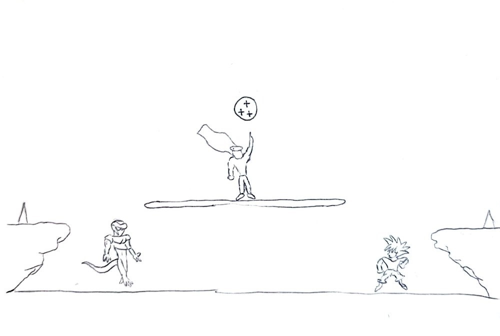

### Lista de verificación
#### 1. Identidad visual

- [x] Definir estilo general Pixel Art 2D .
- [x] Establecer resolución base del juego.
- [x] Mantener coherencia visual entre personajes y escenarios.

#### 2. Diseño de personajes

- [x] Crear bocetos iniciales de cada luchador.
- [x] Definir estilo de combate.
- [x] Crear el sprite base.
- [x] Diseñar animaciones:
  - [x] Caminar
  - [x] Saltar
  - [x] Ataque 
  - [x] Recibir daño
  - [x] Animación de derrota

#### 3. Efectos visuales

- [x] Añadir feedback visual claro al recibir daño.

#### 4. Escenarios

- [x] Diseñar fondo principal.
- [x] Comprobar que el fondo no distraiga del combate.

#### 5. Interfaz (UI)

- [x] Diseñar barras de vida.
- [x] Diseñar pantalla de controles.
- [x] Diseñar pantalla de KO.

#### 6. Coherencia y pruebas

- [x] Revisar que todas las animaciones tengan el mismo tamaño base.
- [x] Comprobar fluidez de animaciones.
- [x] Ajustar tiempos de ataque según jugabilidad.
- [x] Verificar legibilidad en combate rápido.

## **2. Arte**

En la parte visual se ha diseñado un juego estilo 2d con pixel art inspirado en juegos como Streat Figther, pero adaptado con personajes, fondos, escenario, interfaz grafica y sprites de la icónica seria de *Dragon Ball* 

### **A. Sprites de Personajes**

En los sprites los dos personajes hasta el momento (Cooler y Goku) estos cuentan con las mismas animaciones, a continuación solo se utilizará a un personaje para mostrar como se mueven.

- **Idle:** Animación de reposo y guardia.

	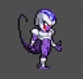

- **Entrada:** Animación de entrada al combate.
	
	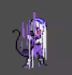

- **Ataque:** Animación de puñetazo.

	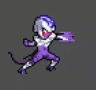

- **Movimiento:** Animación de movimiento.

	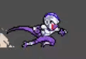

- **Recibir golpe:** Animación de retroceso después de recibir golpe.
	  
	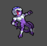

- **Muerte:** Animación de muerte.
  
	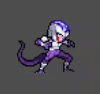

### **B. Enemigos**	

- **Enemigo dinámico:** Su labor será proteger la bola del dragón de *Goku* y *Cooler*.
  
	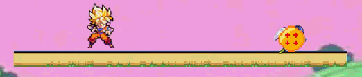

- **Enemigo estático:** Es un afilado picho que hará daño a cualquiera que lo toque .
  	
	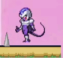

### **C. Interfaz de Usuario**

La interfaz no es solo visual, sino que forma parte de la experiencia funcional del juego:
- **Barra de Salud:** La barra de salud es del estilo artístico de *Dragon Ball* ya que son rastreadores que muestran el estado de vida actual del jugador.
	
	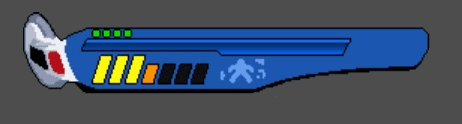

- **Iconos:** Los iconos muestran a quien pertenece cada barra de vida y aparecen encima de las mismas.
   
   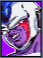
   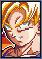

- **Vida Extra:** La esfera es una bola del dragón que al cogerla se convierte en una vida para el jugador que primero consiga alcanzarla.

	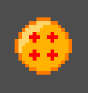

- **Menú:** Al iniciar el juego se muestra el menú con las diferentes opciones.

	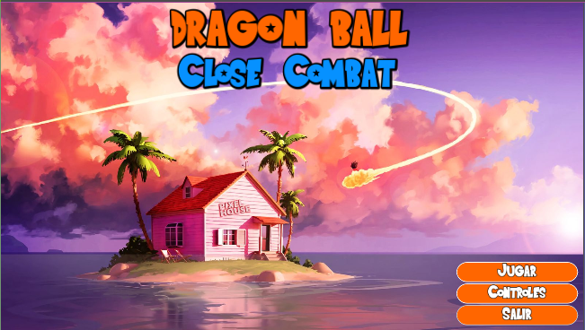

- **Pantalla de controles:** Se muestra los controles de cada jugador y para que sirve la bola de dragón.

	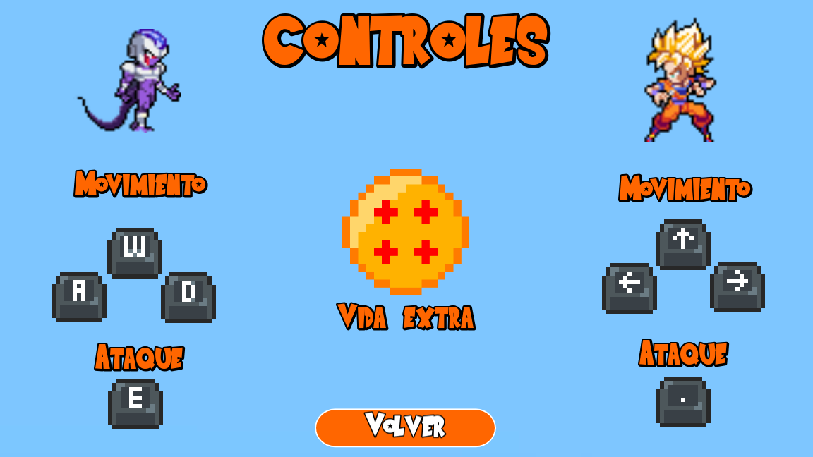

- **Escenario de combate:** Es donde ocurre toda la acción, cuenta con diferentes plataformas y obtáculos que dan dinamismo al combate.

	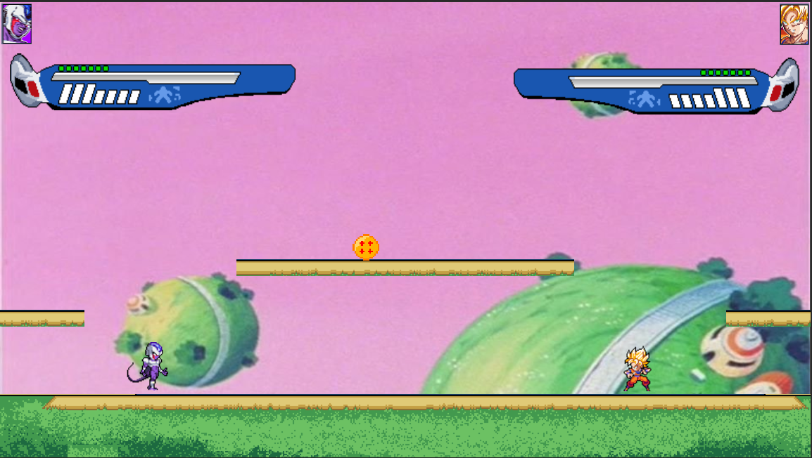

- **Knockout:** Se trata de un sprite que aparece cuando un jugador muere, por la fuente que sea.

	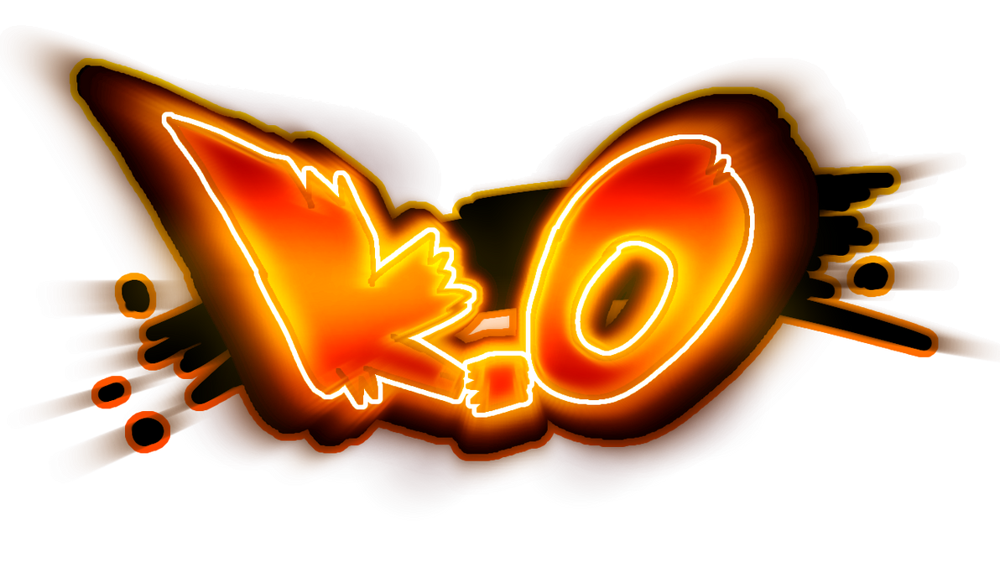

### **D. Sonidos**

En el juego se han implementado varios sonidos para que la inmersión del juego se más realista y fiel a la serie.

- **Sonido del menú:** En el menú se escucha una de la muchas icónicas melodías con las que cuenta **Dragon Ball**.
- **Sonido de pelea:** Se escucha de fondo una música de tensión, digna de la saga de **Dragon Ball Z**.
- **Sonido de golpeo:** Cuando los personajes dan un puñetazo se escucha un sonido de golpeo el cual refuerza la sensación de impacto y realismo de la batalla.
-  **Sonido de K.O:** Cuando uno de los personaje muere y concluye la batalla se escucha un sondo diciendo "K.O".

## **3. Programación**

En este apartado se detallan los elementos técnicos utilizados para el desarrollo del videojuego, explicando su funcionamiento de forma estructurada y clara.

El juego ha sido desarrollado utilizando el motor **Godot Engine**, haciendo uso de nodos como `CharacterBody2D`, `Area2D`, `AnimationPlayer` y el sistema de señales para la comunicación entre elementos.

### **A. Pantallas**

La gestión de pantallas (menú, controles, combate, etc.) se ha implementado mediante el uso de escenas independientes.

Para cambiar entre pantallas se utiliza el método:

- `get_tree().change_scene_to_file()` para cargar nuevas escenas.
- `get_tree().current_scene` para acceder a la escena activa.
- `create_timer()` para realizar transiciones temporizadas, como al finalizar el combate.

Los botones del menú están conectados mediante señales, permitiendo ejecutar funciones específicas al ser pulsados.

### **B. Personajes**

Los personajes están programados mediante scripts que heredan de `CharacterBody2D`, lo que permite aprovechar el sistema de físicas integrado del motor.

Ambos personajes comparten prácticamente la misma estructura lógica para garantizar equilibrio en el combate.

La programación del personaje se divide en distintos sistemas:

#### **B.1 Sistema de Movimiento**

El movimiento horizontal se gestiona mediante:

- `Input.get_axis()` para detectar dirección.
- `move_toward()` para aplicar aceleración y fricción progresiva.
- `move_and_slide()` para aplicar el movimiento final respetando colisiones.

El salto se controla verificando si el personaje está en el suelo con `is_on_floor()` antes de aplicar la fuerza vertical.

La gravedad se aplica manualmente mediante una función que incrementa la velocidad vertical cuando el personaje no está apoyado en el suelo.

#### **B.2 Sistema de Animaciones**

Las animaciones están controladas mediante un `AnimationPlayer`.

Se utilizan señales como:

- `animation_finished`
- `frame_changed`

Esto permite:

- Activar la hitbox de ataque en el frame exacto del golpe.
- Reproducir sonidos sincronizados con el impacto.
- Detectar cuándo termina una animación para cambiar de estado.

La función `update_animation()` decide qué animación reproducir dependiendo del estado actual del personaje (idle, movimiento, salto, ataque, recibir golpe o muerte).

#### **B.3 Sistema de Combate**

El combate se basa en un sistema de detección por **hitboxes**.

Cada personaje cuenta con:

- **Hitbox corporal:** Esta hitbox está siempre activa por defecto y es la que permite que el jugador pueda apoyarse en el suelo e interactuar con los elementos del mapa, como plataformas, enemigos, collecionables y el otro jugador, por supuesto.
- **Hitbox de ataque (Area2D):** Esta hitbox funciona de una forma algo más compleja a la corporal. Por defecto, esta hitbox está siempre desactivada y solo se hace sólida cuando el jugador realiza un ataque

Cuando la hitbox de ataque detecta un cuerpo enemigo mediante la señal `body_entered`, se llama a la función `recibir_golpe()` del rival.

Dentro de esa función:

- Se aplica retroceso modificando la `velocity`.
- Se reduce la vida mediante `quitar_vida()`.
- Se activa un estado de stun temporal.
- Se activa un estado de invencibilidad breve.

Esto evita que un jugador pueda recibir múltiples impactos consecutivos sin posibilidad de reacción.

#### **B.4 Sistema de Estados**

El personaje funciona mediante un sistema de estados booleanos:

- `atacando`
- `estuneado`
- `invencible`
- `muerto`
- `entrando`

En cada `physics_process` se verifica el estado actual y se ejecuta el comportamiento correspondiente.

Este sistema permite:

- Bloquear movimiento durante ataques, es decir, si un jugador inicia la acción de ataque este no podrá realizar ninguna otra acción, a excepción de un pequeño pivotaje en el aire, mientras la animación del golpe esté activa.
- Impedir acciones mientras está stuneado.
- Ignorar daño mientras es invencible.
- Desactivar colisiones al morir.

La función `handle_invencible()` controla el tiempo de invulnerabilidad reduciendo un temporizador cada frame.

#### **B.5 Sistema de Vida**

Cada personaje tiene:

- `vida_maxima`
- `vida_actual`

Cuando recibe daño:

1. Se reduce la vida con `clamp()` para evitar valores negativos.
2. Se emite la señal `actualizar_interfaz_vida`.
3. Si la vida llega a 0 se ejecuta `morir()`.

Al morir:

- Se desactivan capas de colisión.
- Se reproduce la animación de muerte.
- Se muestra el sprite de K.O.
- Se regresa al menú tras un pequeño retardo.

Este sistema mantiene sincronizada la lógica del personaje con la interfaz gráfica.

#### **B.6 Sistema de Vida Extra**

Se implementó un objeto coleccionable (Bola de Dragón) que aparece tras un tiempo determinado.

Cuando un jugador entra en contacto con ella:

- Se comprueba que su vida no esté al máximo.
- Se suma 1 punto de vida.
- Se actualiza la interfaz automáticamente.

Con este objeto en combate se busca brindar mas dinamismo a la pelea y conseguir que los combates puedan cambiar su curso repentinamente haciéndolo más interesante.

### **C. Enemigos**

Dentro del escenario se han implementado dos tipos de enemigos con comportamientos diferenciados: uno dinámico (con movimiento autónomo) y otro estático (orientado únicamente a la detección de daño).

Ambos comparten la misma integración con el sistema de combate del jugador.

#### **C.1 Enemigo Dinámico**

El enemigo dinámico hereda de `CharacterBody2D`, lo que permite integrarlo dentro del sistema de físicas del juego.

Su comportamiento se basa en tres pilares principales:

**1. Control de físicas**

En cada `physics_process`:

- Se aplica la gravedad utilizando el valor global configurado en el proyecto.
- Se utiliza `move_and_slide()` para gestionar desplazamiento y colisiones de forma coherente con el entorno.

**2. Sistema de patrullaje**

El movimiento se controla mediante una variable de dirección (`sentido`), que se invierte cuando:

- Se detecta una colisión con una pared mediante `is_on_wall()`.
- No se detecta suelo delante utilizando nodos `RayCast2D`.

Este sistema permite un comportamiento autónomo sencillo sin necesidad de implementar una inteligencia artificial compleja.

**3. Sistema de daño**

El enemigo incorpora un `Area2D` que detecta la entrada de cuerpos mediante la señal `body_entered`.

Cuando detecta un jugador:

- Comprueba si pertenece al grupo `jugador1` o `jugador2`.
- Verifica que tenga implementado el método `recibir_golpe()`.

En caso afirmativo, llama a dicho método enviando el daño y su posición global.

De esta forma, toda la lógica de daño permanece centralizada en el script del jugador.

#### **C.2 Enemigo Estático**

El enemigo estático hereda directamente de `Area2D`, ya que no requiere físicas ni movimiento.

Su función se limita a actuar como zona de peligro dentro del escenario.

Cuando un jugador entra en su área:

- Se verifica que pertenezca a uno de los grupos de jugador.
- Se comprueba la existencia del método `recibir_golpe()`.
- Se ejecuta dicha función, aplicando daño automáticamente.

Este diseño permite reutilizar completamente el sistema de vida, invencibilidad y retroceso del jugador sin duplicar lógica.

#### **C.3 Integración con el Sistema General**

Ambos tipos de enemigo utilizan el mismo método de daño (`recibir_golpe()`), lo que garantiza:

- Compatibilidad con el sistema de estados.
- Respeto del tiempo de invencibilidad.
- Aplicación correcta del retroceso.
- Coherencia con el sistema de vida y muerte.

Gracias a esta arquitectura modular, los enemigos pueden ampliarse fácilmente sin modificar la base del sistema de combate.

## **4. Elementos Destacables**

En esta parte se detallan las mecánicas novedosas que aportan profundidad al gameplay y los problemas tenidos durante el desarrollo del proyecto de *Dragon Ball Close Combat*:
	
### **A. Innovaciones**

- **Sprite de vida vinculado a jugador:** La barra de vida está conectada directamente a los sprites, esto hace que cambie en tiempo real el estado de la vida del jugador, mostrando el color de la barra distinto según la cantidad de vida exacta que tenga el jugador en ese momento.
- **Sistema de Regeneración de vida:** Se implementó un sistema donde una Bola de Dragón aparece en el escenario tras un tiempo determinado. Si el jugador la recoge y no ha alcanzado su nivel máximo de salud (7 vidas) se suma un punto de vida automáticamente, actualizando de esta forma su barra de vida.
- **Mecánicas de Combate:**
	- **Impacto:** Al dar un puñetazo se activa la hitbox destinada a detectar dicho movimiento, si un cuerpo enemigo entra en contacto con esta hitbox mientras está activa ocurre el impacto deseado.
	- **Retroceso:** Al recibir un ataque el personaje realiza automáticamente una animación de retroceso, simulando que ha recibido un golpe, durante la cual el personaje queda stuneado durante 0.5 segundos.
	- **Estado de Invencibilidad:** Tras recibir un golpe se activa un breve periodo de invulnerabilidad para evitar que el jugador pierda toda la vida por ataques seguidos, permitiendo una oportunidad de contraataque, ya que si no estuviese esta función un jugador podría acorralar a otro sin posibilidad de escape.

- **Knockout:** Se programó una detección de muerte que al terminar el combate hace aparecer un *sprite* de **K.O** en pantalla con un audio acorde a la epicidad del combate. Segundos después de la aparición del **K.O** en pantalla se regresará automaticamente al menú de inicio para iniciar una nueva partida.

### **B. Problemas encontrados**

Durante el desarrollo de este proyecto nos encontramos con diferentes dificultades.

**B.1 Hitbox**
Un problema que tuvimos a la hora de programar las hitbox de golpeo de los personajes fue que, en un inicio, dibujamos la hitbox unicamente a un lateral del personaje y esperábamos poder rotar la hitbox conforme rotase el cuerpo del jugador. Finalmente esta mecánica no fue posible implementarla y decidimos tomar una solución más sencilla pero menos pulida, la cual fue ampliar la hitbox de golpeo para que esta sobresaliese por ambos lados.
Este sería un punto que se debería corregir en futuras actualizaciones.

**B.2 Deslizamiento de los personajes**
A la hora de programar las físicas de ambos personajes encontramos un problema con el deslizamiento. Este se basaba en que si el personaje contaba con una inercia de movimiento, ya fuese vertical o horizontal, y este realizaba la acción de atacar, el personaje comenzaba un deslizamiento infinito a velocidad constante el cual rompía completamente la física y fluidez del gameplay. Para solucionar dicho problema se decidió cancelar cualquier tipo de movimiento causado por inercia en el momento en el que el jugador decidiese atacar con su personaje, solucionando así este problema.

  
